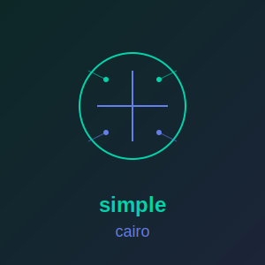

<p align="center">
  
</p>

# simple_cairo

**[Documentation](https://simple-eiffel.github.io/simple_cairo/)** | **[GitHub](https://github.com/simple-eiffel/simple_cairo)**

[](https://opensource.org/licenses/MIT)
[](https://www.eiffel.org/)
[]()

**Cross-platform 2D graphics library** wrapping Cairo for Eiffel applications.

Part of the [Simple Eiffel](https://github.com/simple-eiffel) ecosystem.

## Status

**Production** - Core functionality complete, edge-case tests passing

## Features

- **Surfaces** - ARGB32, RGB24, A8, A1 image formats
- **Drawing** - Rectangles, circles, lines, arcs, Bezier curves
- **Colors** - RGB, RGBA, hex color support
- **Gradients** - Linear and radial gradients with color stops
- **Text** - Font selection, sizing, and rendering
- **Transforms** - Translate, scale, rotate
- **Waveforms** - Audio visualization for speech applications
- **PNG Export** - Save surfaces to PNG files

## Installation

### Prerequisites

#### Windows

1. Download Cairo from [GTK+ for Windows](https://www.gtk.org/docs/installations/windows/) or build from source
2. Set `CAIRO_PATH` environment variable to your Cairo installation directory
3. Ensure `cairo.dll` is in your PATH or application directory

#### Linux

```bash
sudo apt install libcairo2-dev   # Debian/Ubuntu
sudo dnf install cairo-devel     # Fedora
sudo pacman -S cairo             # Arch
```

### Add to Your ECF

```xml
<library name="simple_cairo" location="$SIMPLE_EIFFEL/simple_cairo/simple_cairo.ecf"/>
```

## Quick Start

```eiffel
local
    cairo: SIMPLE_CAIRO
    surface: CAIRO_SURFACE
    ctx: CAIRO_CONTEXT
do
    create cairo.make
    surface := cairo.create_surface (400, 300)
    ctx := cairo.create_context (surface)

    -- Clear to white
    ctx.set_color_rgb (1.0, 1.0, 1.0).paint.do_nothing

    -- Draw blue rounded rectangle
    ctx.set_color_hex (0x3498DB)
       .rounded_rectangle (50, 50, 300, 200, 20)
       .fill.do_nothing

    -- Draw red circle outline
    ctx.set_color_hex (0xE74C3C)
       .set_line_width (4.0)
       .stroke_circle (200, 150, 50).do_nothing

    -- Save to file
    surface.write_png ("output.png")

    ctx.destroy
    surface.destroy
end
```

## Gradients

```eiffel
local
    grad: CAIRO_GRADIENT
do
    -- Create vertical gradient
    grad := cairo.vertical_gradient (0, 100)
    grad.add_stop_hex (0.0, 0x3498DB)   -- Blue at top
        .add_stop_hex (1.0, 0x2ECC71)   -- Green at bottom
        .do_nothing

    -- Fill rectangle with gradient
    ctx.set_gradient (grad)
       .fill_rect (0, 0, 200, 100).do_nothing

    grad.destroy
end
```

## Waveform Visualization

For audio/speech applications:

```eiffel
-- Draw waveform from int16 PCM samples
ctx.set_color_hex (0x3498DB)
   .set_line_width (1.0)
   .draw_waveform_i16 (samples_pointer, sample_count, 10, 10, 380, 100).do_nothing
```

## API Classes

| Class | Purpose |
|-------|---------|
| SIMPLE_CAIRO | Facade - Factory for surfaces, contexts, gradients |
| CAIRO_SURFACE | Image surface wrapper |
| CAIRO_CONTEXT | Drawing context with fluent API |
| CAIRO_GRADIENT | Linear and radial gradient patterns |

## Dependencies

- Cairo library (libcairo)
- ISE EiffelBase

## License

MIT License - See LICENSE file

---

Part of the **Simple Eiffel** ecosystem.
